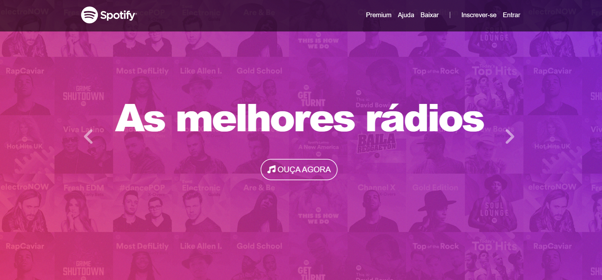

# 🎧 Spotify Clone - Front-End Project

> Responsive Spotify UI clone built with HTML, CSS, JavaScript and Bootstrap.

## 📌 About the Project
This project is a responsive front-end clone of the Spotify interface, developed to practice modern web development concepts and UI replication.

## 🎯 Objective
- Recreate a real-world application interface
- Improve responsive design skills
- Practice clean and structured code

## 🧰 Technologies Used
<p align="left">
  
  
  
  
</p>

## 💻 Features
- Responsive layout (mobile & desktop)
- Music player interface simulation
- Navigation menu
- Organized UI components

## 🌐 Live Demo
🔗 https://clone-spotify-nine-inky.vercel.app/

## 📸 Preview

<p align="center">
  <a href="https://clone-spotify-nine-inky.vercel.app/">
    
  </a>
</p>

<p align="center">
  🔗 <strong>Click on the image to access the project</strong>
</p>

## 🚀 How to Run

```bash
git clone https://github.com/NandaAtenaTec/clone-spotify
````

## 🧠 What I Learned
- Responsive design techniques for multiple screen sizes
- UI replication from real-world applications
- Better component and layout structuring
- Writing cleaner and more organized code

  ## 📁 Project Structure
- index.html
- css/
- assets/


